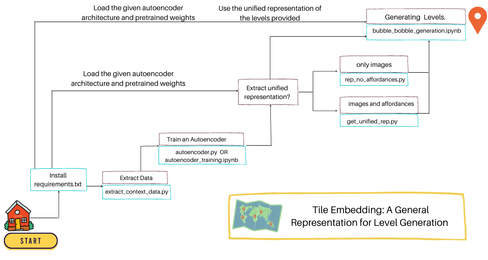
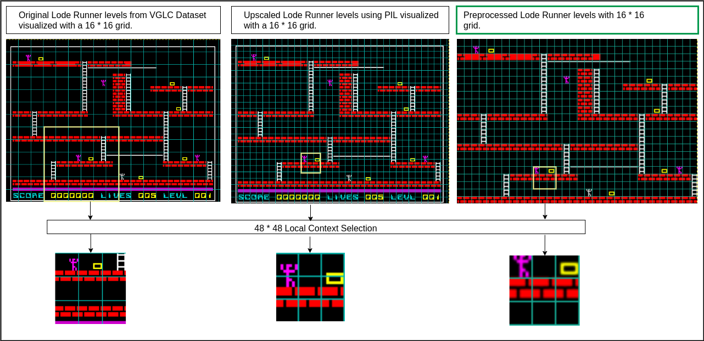
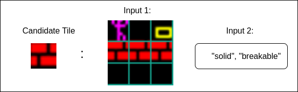

# Tile Embedding: A General Representation for Level Generation
### Authors: Mrunal Jadhav and Matthew Guzdial 

In  recent  years,  Procedural  Level  Generation  via  Machine Learning (PLGML) techniques have been applied to generate game levels with machine learning. These approaches rely on human-annotated representations of game levels. Creating annotated datasets for games requires domain knowledge and is time-consuming. Hence, though a large number of video games exist, annotated datasets are curated only for a small handful. Thus current PLGML techniques have been explored in limited domains, with Super Mario Bros. as the most common example. To address this problem, we present tile embeddings,  a  unified,  affordance-rich  representation  for  tile-based  2D  games.  To  learn  this  embedding,  we  employ  autoencoders trained on the visual and semantic information oft iles from a set of existing, human-annotated games. We evaluate this representation on its ability to predict affordancesfor unseen tiles, and to serve as a PLGML representation for annotated and unannotated games.

## Our contributions through this repository
To promote future research and as a contribution to PCGML community, through this repository we provide:
1. An end to end implementation for extracting the data and training an autoencoder to get a single, unified representation which we refer as **tile embeddings**.
2. A tutorial notebook for generating levels of the game Bubble Bobble using LSTMs and tile embeddings.
3. JSON files with context data for every unique tile type.
4. Preprocessed level images for the game Bubble Bobble. 

<!-- Paper: 
Please cite : -->

## Quick Rundown
1. [Data Extraction and Preparation](#1-data-extraction-and-preparation)
2. [Autoencoder Training](#2-autoencoder-for-tile-embeddings)
3. [Level Representation using tile embeddings](#3-unified-level-representation-with-tile-embeddings)
4. [Bubble Bobble level generation using LSTM](#4-generating-level-representation-for-bubble-bobble)
5. [How can you contribute to this project](#how-can-you-contribute-to-this-project?)


## How do I use this repository?

Too many scripts to run? The flow chart below answers the questions related to which scripts to run and in what order :) 



## 0 Installing Virtual Environment

```
pipenv install --dev
```

## 1 Data Extraction and Preparation
**Prerequisites:**
* Step 0

The training data for our implementation includes five games: *Super Mario Bros, Kid Icarus, Legend of Zelda, Lode Runner, Megaman*. To train the autoencoder for obtain an embedded representation of tile, we draw on local pixel context and the affordances of the candidate tile. 

> 1. Local Pixel Context: To extract the 16 * 16 tiles along with its local context, we slide a 48 * 48 window over the level images. The parent dataset for level images is [VGLC](https://github.com/TheVGLC/TheVGLC). However, level images for some games have extra pixels along the vertical/horizontal axis which result in off-centered tile sprite extraction(demonstrated in fig). We perform prelimnary image manipulations on this dataset to fit the dimensions of such level images. Lode Runner levels has 8 * 8 tile size which we upscaled to 16 * 16 using the [PIL](https://pillow.readthedocs.io/en/stable/) library. We provide the preprocessed dataset directory [vglc](https://github.com/js-mrunal/tile_embeddings/tree/main/data/vglc).



To extract the context for all five games run the following. 
1. Move to directory: context_extraction
```
cd notebooks/
```

2. Run the following command in shell
```
python extract_context_data.py
```

On successful execution of this code, navigate to the folder *data > context_data >*. Each game directory populated with visual local context seperated with sub-directories of tile characters. Each game directory also has an JSON file created. It is a dictionary with key as the centre tile, enlisting all possible neighbourhoods it. 

> 2. Affordances: 
We define a single, unified set of 13 tags across the games. The tile character to behaviour mapping is provided as [JSON](https://github.com/js-mrunal/tile_embeddings/tree/main/data/json_files_trimmed_features) files. 
    
    
Inputs obtained are as follows: 



## 2 Autoencoder for Tile Embeddings
**Prerequisites:**
* Step 0
* You can skip Step 1 ONLY IF you want to directly load the provided autoencoder architecture and its pretrained weights (Step (2c)).

Now that we have both our inputs ready, we have to integrate them into a single latent vector representation, which we call *tile embeddings*. To get the embedding, we employ the X-shaped autoencoder architecture. Please find the details of the architecture in our paper. 

2a. The jupyter notebook "notebooks > autoencoder_training.ipynb" provides a step by step guide for autoencoder training. 

2b. You can also run the following commands to train the autoencoder and save the weights:

> Move to the directory: notebooks
```
cd notebooks/
```
> Run the following command in shell
```
python autoencoder_training.py
```
2c. Load the directly provided architecture and pretrained weights to perform evaluation. Sample Notebook:  
```
evaluating_autoencoder_on_text.ipynb
```

## 3 Unified Level Representation with Tile Embeddings
**Prerequisites:**
* Step 0
* (Optional) Step 1 followed by Step 2 

In this step we convert the levels to the embedding representation using tile embeddings. There are two ways to go about this step. 

3a. If the game data has affordance mapping present, leverage it to get the tile embeddings. The following notebook converts the  levels of all the games in our training dataset into a unified level representation by considering visuals as well as affordances. 
```
python generate_unified_rep.py
```
After the execution of this notebook the embedding representation of the levels for the games *Super Mario Bros, Kid Icarus, Megaman, Legend of Zelda, Lode Runner* will be stored in the directory *data>unified_rep*. 

3b. In case of missing affordances, we provide evidence that the autoencoder can still approximate the embedding vectors (refer paper). To address such datasets, refer the following script
```
python rep_no_affordances.py
```
After the execution of this python code the embedding representation of the *Bubble Bobble* levels will be stored in *data>unified_rep>* 

*Note: Feel free to skip this step and directly use the provided the pickle files. Navigate to data>unified_rep, you will find the embedding representation of the levels for the games: Super Mario Bros, Kid Icarus, Megaman, Legend of Zelda, Lode Runner, Bubble Bobble *

## 4 Generating Level Representation for Bubble Bobble
**Prerequisites:**

The notebook *bubble_bobble_generation.ipynb* provides step-by-step instructions in detail for generating levels of the game Bubble Bobble using LSTM and tile embeddings.
 

## How can you contribute to this project?
* Add more data! Training the autoencoder on more games and enriching the corpus 
* Perform cool experiments with tile embedding, and cite us :)
* Find bugs and help us make this repository better!
