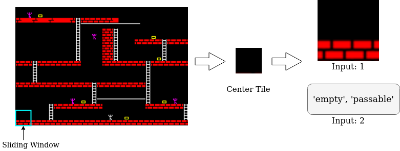

# Tile Embedding: A General Representation for Level Generation.
### Authors: Mrunal Jadhav and Matthew Guzdial 

In  recent  years,  Procedural  Level  Generation  via  Machine Learning (PLGML) techniques have been applied to generate game levels with machine learning. These approaches rely on human-annotated representations of game levels. Creating annotated datasets for games requires domain knowledge and is time-consuming. Hence, though a large number of video games exist, annotated datasets are curated only for a small handful. Thus current PLGML techniques have been exploredin limited domains, with Super Mario Bros. as the most common example. To address this problem, we present tile embeddings,  a  unified,  affordance-rich  representation  for  tile-based  2D  games.  To  learn  this  embedding,  we  employ  autoencoders trained on the visual and semantic information oft iles from a set of existing, human-annotated games. We evaluate this representation on its ability to predict affordancesfor unseen tiles, and to serve as a PLGML representation for annotated and unannotated games.

<!-- Paper: 
If you use the data please cite : -->

## Install Dependencies

```
pip install -r requirements.txt
```

## Extracting the Data

For this implementation, we use the data from [VGLC Corpus](https://github.com/TheVGLC/TheVGLC). Our training data includes five games: *Super Mario Bros, Kid Icarus, Legend of Zelda, Lode Runner, Megaman*. We train a X-shaped autoencoder which takes two inputs:

1. Tile Sprite with its neighbourhood context.
2. Affordances associated with the tile sprite. 

The data extraction takes places as follows: 
> We slide a 48 * 48 window over the level images to extract the tile sprites with its local context. As preprocessing, we have performed prelimnary image manipulations to fit the dimensions of the levels images. For instance some SMB levels had extra pixels along the vertical/horizontal axis which results in off-centered tile extraction.Lode Runner levels has 8 * 8 tile size which we upscaled to 16 * 16 using the PIL library. The preprocessed dataset is stored in [vglc]("data/vglc/") directory



To extract the context for one game run the following 

1. Move to directory: context_extraction
```
cd notebooks/context_extraction
```

2. Run the following command in shell
```
python extract_context.py
```

On navigating to the folder *data > context_data >* each game folder should be populated by its visual context sorted by the centre tile.
The json files generated in each game directory is a dictionary with key as the centre tile and value enlisting all possible neighbourhoods it. 

## Training autoencoder

1. The jupyter notebook "notebooks > autoencoder_training.ipynb" provides a step by step guide for autoencoder training. 

2. You can also run the following commands to train the autoencoder and save the weights:

>a. Move to the directory: notebooks
```
cd notebooks/
```
>b. Run the following command in shell
```
python autoencoder_training.py
```

3. Load the directly provided architecture and weights. Sample Notebook: 

## Generating Level Representation using trained autoencoder-Bubble Bobble
The notebook *bubble_bobble_generation.ipynb* demonstrates step by step level generation using tile embedding.
